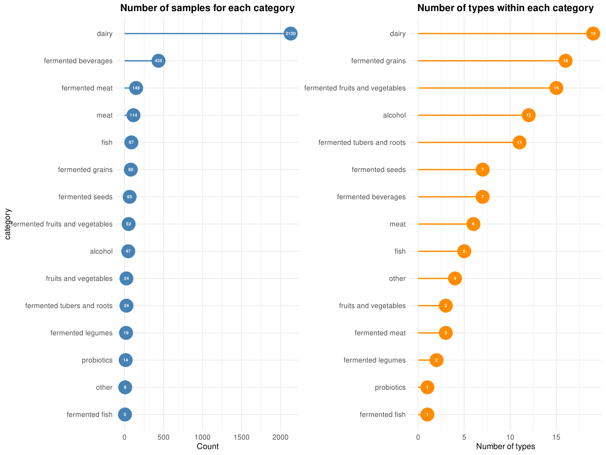
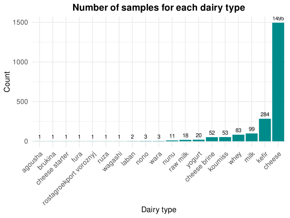
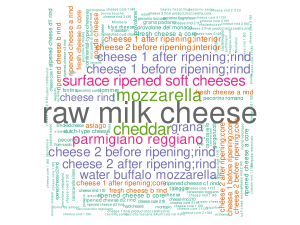
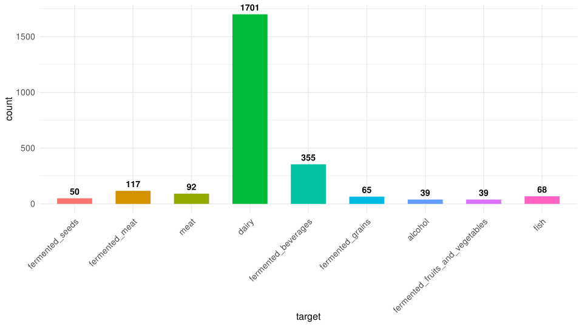
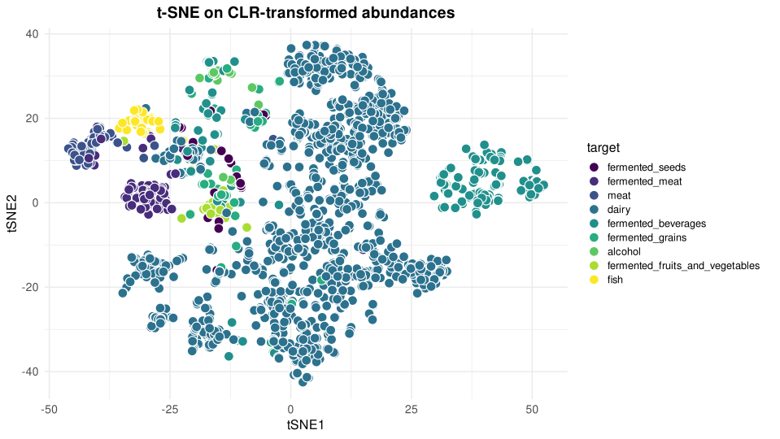
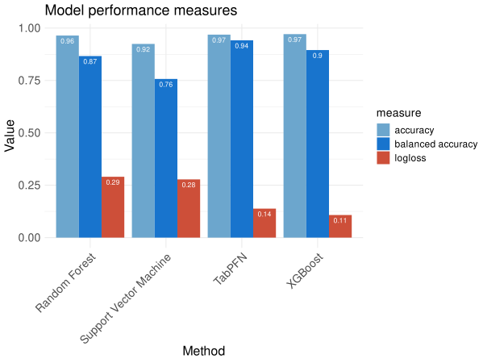
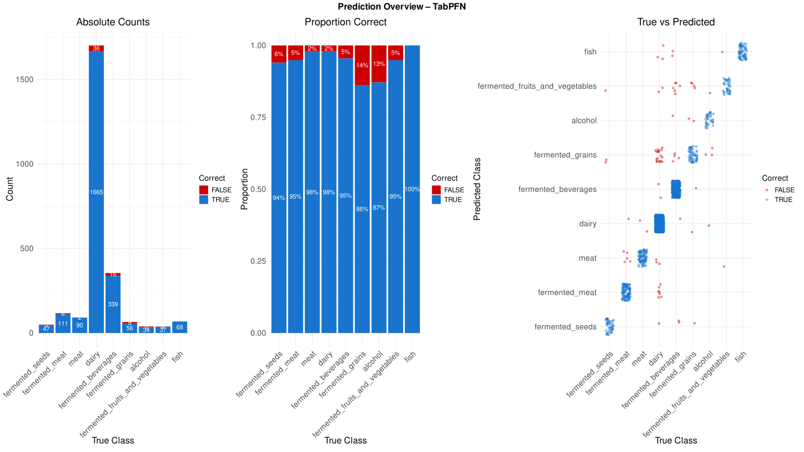
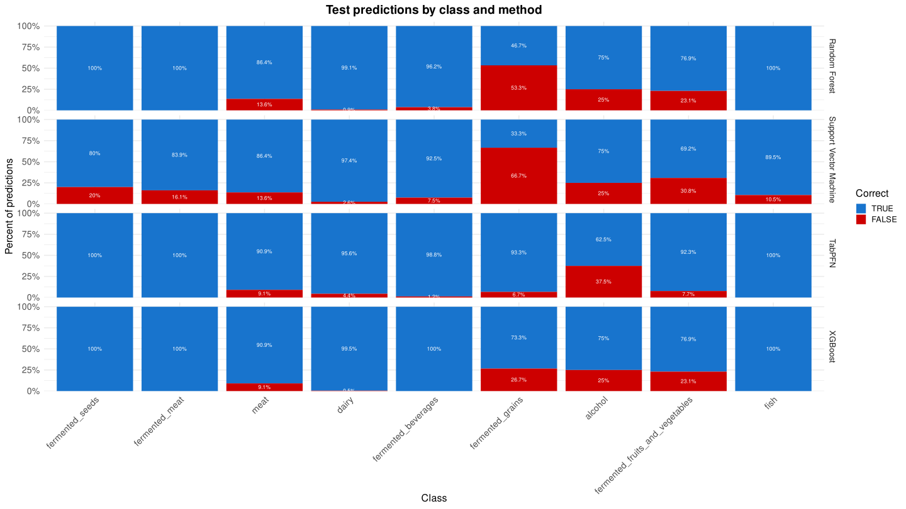
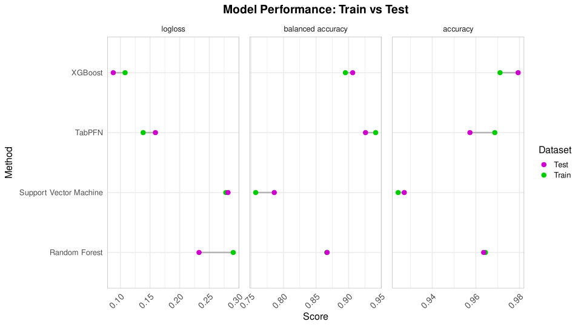
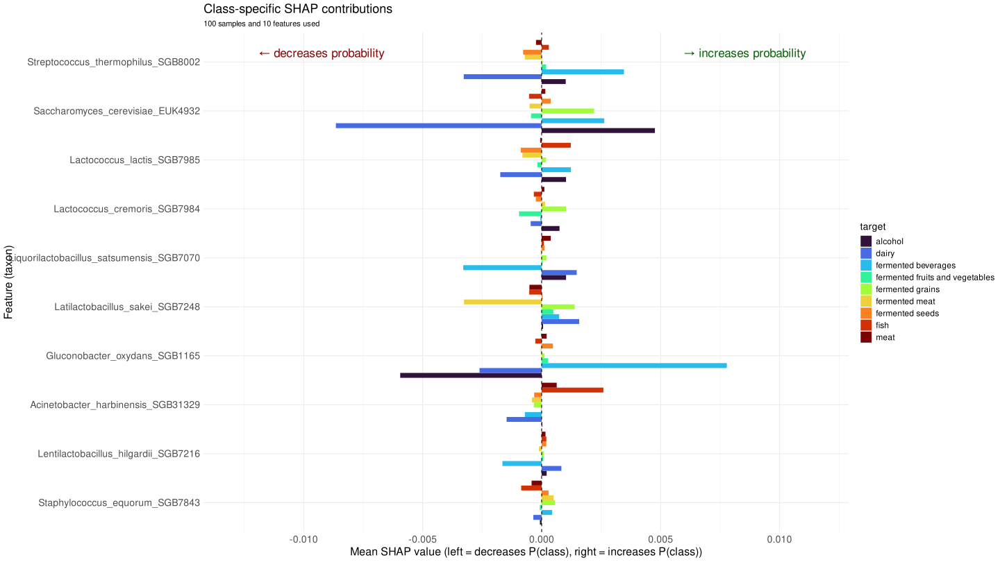

# cFMDbench

*ML classification on cFMD taxonomic profiles with mlr3. Quarto workflow. Conda envs. For teaching and testing.*

[](https://www.r-project.org/)
[](https://mlr3.mlr-org.com/)
[](https://www.python.org/)
[](https://scikit-learn.org/)
[](https://pytorch.org/)
[](https://docs.conda.io/)
[](https://quarto.org/)
[](https://posit.co/positron/)

## Rationale

`cFMDbench` provides a workflow for machine‑learning classification on metagenomic taxonomic profiles using the [mlr3](https://mlr3.mlr-org.com/) ecosystem. The benchmark uses [cFMD](https://github.com/SegataLab/cFMD), the largest public food microbiome resource, enabling model training and comparisons on metagenomic data. The goals are didactic and testing: demonstrate data import, filtering, feature selection, tuning, and evaluation across multiple learners.

## Repository layout

```
cFMDbench/
├── analysis/
│   └── cFMDbench.qmd        # Main Quarto notebook — the only file you run
├── R/
│   ├── cfmdbench_config_helpers.R    # Config loading, method resolution, backend setup
│   ├── cfmdbench_data_helpers.R      # GitHub API download, caching, data preparation
│   ├── cfmdbench_training_helpers.R  # Learner building, pipeline assembly, tuning loop
│   └── cfmdbench_scoring_helpers.R   # Benchmark formatting, prediction collection
├── conda/
│   ├── cfmdbench-r.yml               # R-focused Conda environment (base setup)
│   ├── cfmdbench-tabpfn-gpu.yml      # TabPFN Python environment (GPU/CUDA)
│   ├── install_r_packages.R          # Pre-installs heavy R packages before first run
│   └── README.md                     # Detailed setup instructions for both environments
├── config.yaml              # All tunable parameters — edit this to customise a run
├── .Renviron.example        # Template for secrets (tokens, paths) — copy to ~/.Renviron
└── cFMDbench.Rproj          # RStudio project file
```

## Table of Contents
- [Installation](#installation)
- [Configuration](#configuration)
- [Run](#run)
- [Dependency and environment management](#dependency-and-environment-management)
- [cFMDbench roadmap](#cfmdbench-roadmap)
- [Acknowledgements](#acknowledgements)
- [Citation](#citation)

---

## Installation

### 1) R environment

Create the R Conda environment and pre-install the heaviest R packages. Remaining packages are auto-installed on first run via `pacman`.

```bash
# Create and activate the R environment
conda env create -f conda/cfmdbench-r.yml
conda activate cfmdbench-r

# Pre-install core R packages (skips CRAN prompts during the first notebook run)
Rscript conda/install_r_packages.R
```

- *On first run, `analysis/cFMDbench.qmd` uses `pacman` to automatically install any remaining missing R packages.*
- *See `conda/README.md` for RStudio, Positron, and VS Code setup instructions.*

### 2) TabPFN environment (optional)

[TabPFN](https://github.com/PriorLabs/TabPFN) runs through `reticulate` from R. It requires a separate Python Conda environment and is only needed if `tabpfn` is listed in `config.yaml` under `methods.pick`.

```bash
conda env create -f conda/cfmdbench-tabpfn-gpu.yml
```

- *TabPFN and the MLP learner (`mlr3torch`) are mutually exclusive — they both initialise a CUDA context and conflict when run in the same R session. Choose one or the other in `config.yaml`.*

---

## Configuration

### `config.yaml` — analysis parameters

All analysis settings are in `config.yaml` at the repo root. Edit this file to change which methods to run, tuning budget, feature selection behaviour, etc. You do **not** need to touch the notebook or helper scripts for routine customisation.

Key sections:

| Section | Key | Default | What it controls |
|---|---|---|---|
| `methods` | `pick` | `["ranger","xgboost"]` | Which classifiers to run. Use `"all"` or a list. Valid: `glmnet`, `kknn`, `lda`, `mlp`, `naive_bayes`, `ranger`, `svm`, `tabpfn`, `xgboost` |
| `execution` | `seed` | `42` | Global random seed |
| `execution` | `kfold` | `10` | Outer CV folds |
| `execution` | `repeats` | `5` | Repeated CV repetitions for small datasets |
| `execution` | `num_threads` | auto | CPU threads; `null` = detect at runtime |
| `execution` | `term_min` | `20` | Per-method tuning time budget (minutes) |
| `execution` | `fast_tuning` | `true` | Multi-fidelity tuning (hyperband/successive halving). Disable for more thorough grid search |
| `execution` | `learner_fallback` | `false` | Replace failed learners with a majority-class predictor rather than aborting |
| `dataset` | `version` | `"v1.3.0"` | cFMD dataset version; also the GitHub tag used for download |
| `dataset` | `target` | `"category"` | Target column name. Change to `"type"` or `"subtype"` for finer classification |
| `data_source` | `completeness_threshold` | `99` | Drop samples whose taxa abundances sum to less than this % |
| `preprocessing` | `min_samples_per_class` | `25` | Drop classes with fewer than this many samples |
| `preprocessing` | `smote` | `""` | SMOTE variant: `""` (auto), `"smote"`, `"blsmote"`, `"adasyn"`, or `"none"` |
| `preprocessing` | `filtering` | `"minimal"` | Feature filter: `"minimal"`, `"varcor"` (variance+correlation), `"infogain"` |
| `preprocessing` | `selecting` | `true` | Run recursive feature selection (RFE) before training |
| `feature_selection` | `num_col` | `100` | Target `n_features = 10` when `ncol ≥ this`; `2` otherwise |
| `feature_selection` | `num_row` | `100` | Use single-learner RFE when `nrow > this`; ensemble RFE otherwise |
| `visualisation` | `shap_n_samples` | `100` | Background dataset size for SHAP (larger = slower but more stable) |
| `visualisation` | `shap_n_features` | `10` | Number of top features shown in SHAP plots |

### `~/.Renviron` — secrets and machine-specific paths

Credentials and paths are **not** stored in `config.yaml`. Define them in `~/.Renviron` outside the repo. Copy `.Renviron.example` as a starting point:

```bash
# GitHub Personal Access Token — required for data download.
# Raises rate limit from 60 to 5000 API requests/hour.
# Create at: github.com/settings/tokens → "Generate new token (classic)"
# Required scope: none (public repo read is enough without any scope selected)
GITHUB_TOKEN=ghp_your_personal_access_token_here

# Optional: override the working directory (defaults to the repo root)
CFMD_BENCH_WORKDIR=/absolute/path/to/your/workdir

# Required only when running TabPFN:
# Create HF token at: huggingface.co/settings/tokens → "New token" → Read access
HF_TOKEN=hf_your_huggingface_token_here
TABPFN_ENV_NAME=cfmdbench-tabpfn-gpu   # Conda env name (default as shown)
TABPFN_CONDA_ROOT=/absolute/path/to/miniconda3
```

- *Reload `.Renviron` after editing by restarting your R session.*
- *Never commit `.Renviron` to git. It is already in `.gitignore`.*

---

## Run

Recommended usage is interactive — run chunks one at a time to inspect each step.

### RStudio (recommended)

```bash
conda activate cfmdbench-r
rstudio cFMDbench.Rproj &
```

Open `analysis/cFMDbench.qmd` and run chunks interactively. The `.Rproj` file sets the working directory to the repo root automatically.

> **Important:** always launch RStudio from a conda-activated terminal, not from a desktop shortcut. A shortcut bypasses conda activation and R will fall back to the system library, missing all project packages.

### Positron / VS Code

See `conda/README.md` for IDE-specific setup. Select the R interpreter from the `cfmdbench-r` Conda environment.

### Customise a run

1. Edit `config.yaml` to choose methods, tune the budget, or change the target variable.
2. Run the notebook chunk by chunk.
3. Tuned models are saved to `<date>_<dataset>_<version>_saved_learners/` — re-running skips already-finished methods automatically.

---

## Dependency and environment management

This section is a reference for keeping the environments healthy over time — useful after months away from the project, on a new machine, or when packages have drifted out of sync.

### Verify the setup before running

Run these checks after any fresh install or system update to catch problems early:

```bash
# Confirm the R environment is active and R version is correct
conda activate cfmdbench-r
R --version            # should show 4.5.x
quarto --version       # should be available

# Confirm the GitHub token is loaded and has sufficient rate limit
Rscript -e "cat('GITHUB_TOKEN set:', nzchar(Sys.getenv('GITHUB_TOKEN')), '\n')"

# Verify mlr3 and key dependencies are installed
Rscript -e "library(mlr3); library(mlr3learners); library(mlr3pipelines); cat('mlr3 OK\n')"

# If TabPFN is selected, verify the Python environment
Rscript -e "
  reticulate::use_condaenv('cfmdbench-tabpfn-gpu', required = TRUE)
  mods <- c('torch','sklearn','tabpfn')
  ok   <- sapply(mods, reticulate::py_module_available)
  print(ok)
"
```

### Update R packages

R packages installed via `install_r_packages.R` and `pacman` do **not** update automatically. Run this periodically to pick up bug fixes and compatibility patches:

```bash
conda activate cfmdbench-r
```

```r
# Update all CRAN packages in the conda env
update.packages(ask = FALSE, repos = "https://cloud.r-project.org")

# Update mlr3extralearners separately — it is GitHub-only and not on CRAN.
# "@*release" always fetches the latest tagged release.
remotes::install_github("mlr-org/mlr3extralearners@*release",
                        upgrade = "never", dependencies = TRUE)
```

> **Note on mlr3 ecosystem updates:** mlr3 packages have strict inter-version dependencies. Update them together (mlr3, mlr3learners, mlr3pipelines, mlr3tuning, mlr3hyperband, mlr3fselect, mlr3filters, mlr3extralearners) rather than one at a time, or a version mismatch will produce cryptic `object not found` errors.

If R torch needs to be reinstalled (e.g. after a CUDA driver update):

```r
torch::install_torch()
```

### Update the TabPFN Python environment

TabPFN is actively developed. To upgrade to a newer version:

```bash
conda activate cfmdbench-tabpfn-gpu
pip install --upgrade tabpfn

# Verify the new version loads correctly
python -c "import tabpfn; print(tabpfn.__version__)"
```

The `conda/cfmdbench-tabpfn-gpu.yml` file pins `tabpfn==6.0.6` and `pytorch=2.9.1`. Update those version pins when upgrading to keep the environment reproducible:

```bash
# After a successful upgrade, export the current state
conda env export -n cfmdbench-tabpfn-gpu > conda/cfmdbench-tabpfn-gpu-pinned.yml
```

> **TabPFN model weights** are downloaded from HuggingFace on first use and cached in `~/.cache/tabpfn/` (typically several GB). If you need to force a re-download (e.g. after a major version bump), delete that directory.

### Recreate environments from scratch

If an environment is corrupted, or you are setting up on a new machine:

```bash
# Remove and recreate the R environment
conda env remove -n cfmdbench-r
conda env create -f conda/cfmdbench-r.yml
conda activate cfmdbench-r
Rscript conda/install_r_packages.R          # base packages
# INSTALL_R_TORCH=1 Rscript conda/install_r_packages.R  # add this for MLP

# Remove and recreate the TabPFN environment (if needed)
conda env remove -n cfmdbench-tabpfn-gpu
conda env create -f conda/cfmdbench-tabpfn-gpu.yml
```

After recreating, re-run the verification commands above before starting a new analysis.

### Pin a reproducibility snapshot

The `.yml` files use loose version specs (e.g. `r-base=4.5`) so they can be recreated across platforms. For a fully reproducible record — useful before a publication or after a successful long run — export the resolved environment:

```bash
# Export exact versions of all conda packages
conda activate cfmdbench-r
conda env export > conda/cfmdbench-r-pinned-$(date +%Y%m%d).yml

# Export the R package versions as well
Rscript -e "
  pkgs <- as.data.frame(installed.packages()[, c('Package','Version')])
  write.csv(pkgs, paste0('conda/r_packages_', Sys.Date(), '.csv'), row.names = FALSE)
"
```

> Store the pinned files alongside the analysis outputs so you can reconstruct the exact environment that produced them.

### Switch to a new cFMD dataset version

> **Compatibility note:** cFMDbench is developed and validated against **cFMD v1.3.0**, which is the version used in all benchmark results shown here. cFMD releases have introduced breaking structural changes without detailed migration guides — notably a full database reorganisation into dataset-specific folders in v1.2.1 and a taxonomy methodology update in v1.3.0. Switching to a newer version may therefore require adjustments to the import code in `cfmdbench_data_helpers.R` before the workflow runs correctly. Treat version upgrades as a porting task, not a drop-in replacement.

The dataset version appears in three places. Update them consistently:

1. **`config.yaml`** — change `dataset.version` to the new tag (e.g. `"v1.x.0"`). This also controls the GitHub ref used for download and the name of the save directory.
2. **Cache** — the new version is downloaded to `cache_cFMD/<new_version>/` automatically on the next run. Old versions already on disk are not touched.
3. **Saved models** — a new save directory is created for the new version; existing models are unaffected.

The version string flows through `cfmdbench_load_config()` and is used as both the GitHub tag and the local directory suffix, so `config.yaml` is the only file to edit — provided the new release is structurally compatible with v1.3.0.

### Manage saved models and cache

```
<date>_<dataset>_<version>_saved_learners/
  ├── selected_features.rds       # feature names from RFE — reloaded on restart
  ├── ranger_tuned_instance.rds   # full tuning history (all configurations tried)
  ├── ranger_tuned_learner.rds    # final trained GraphLearner
  ├── xgboost_tuned_instance.rds
  └── xgboost_tuned_learner.rds

cache_cFMD/
  └── v1.3.0/
      ├── HMP2_taxonomic_profiles.tsv
      ├── ...
      └── cFMD_v1.3.0_manifest.rds  # SHA index for cache validation
```

- **To rerun a specific method** without redoing others: delete `<method>_tuned_instance.rds` and `<method>_tuned_learner.rds` for that method only. The training loop skips methods whose instance file shows `is_terminated = TRUE`.
- **To redo all training** from scratch for a run: delete the entire save directory.
- **To force a full data re-download**: delete `cache_cFMD/<version>/` or just the `manifest.rds` file inside it (the manifest holds the SHA index; without it all files are re-fetched).
- **Disk space**: each `_tuned_instance.rds` can be several hundred MB for methods with large archives (SVM, ranger). Delete instance files after a run if disk space is a concern — the learner `.rds` files are all you need for predictions.

### Troubleshooting

| Symptom | Likely cause | Fix |
|---|---|---|
| `'lrn' is not an exported object from 'namespace:mlr3learners'` | mlr3 packages are out of sync | Update all mlr3 packages together; `lrn()` lives in `mlr3`, not `mlr3learners` |
| `'tnr' is not an exported object from 'namespace:mlr3hyperband'` | Same version drift | `tnr()` lives in `mlr3tuning`; mlr3hyperband registers its tuners there at load time |
| `htop` segfaults in RStudio terminal | `LD_LIBRARY_PATH` contamination from conda | Use a separate system terminal (outside conda) for monitoring tools |
| Torch download prompt appears unexpectedly | `cfmdbench_build_learners()` called without `methods` arg | Pass `methods = names(methods)` so MLP construction is skipped when not selected |
| TabPFN and MLP both fail | Both selected in `config.yaml` | Remove one — they cannot run in the same R session (CUDA context conflict) |
| `HF_TOKEN not set` error | TabPFN selected but token missing | Add `HF_TOKEN=hf_...` to `~/.Renviron` and restart R |
| `GITHUB_TOKEN not set` error | Token missing or `.Renviron` not loaded | Check `Sys.getenv("GITHUB_TOKEN")`; restart R session to reload `.Renviron` |
| Method skipped with "already finished" even after a code change | Old `*_tuned_instance.rds` has `is_terminated = TRUE` | Delete the instance file for that method to force re-tuning |
| Feature importance fails with `object not found` for `<method>_tuned_learner` | Running in a fresh session without the `trained_learners` list | The importance chunk falls back to reading the `.rds` file from `save_dir`; ensure `save_dir` variable points to the right directory |
| `cannot change value of locked binding for '.torch_can_load'` | `install_torch()` ran while `torch` was already loaded (namespace locked) | The binaries downloaded successfully. Just restart R (Session → Restart R) and re-run — do **not** call `install_torch()` again |
| `reticulate::use_condaenv` fails | `TABPFN_CONDA_ROOT` path is wrong | Set `TABPFN_CONDA_ROOT` to the output of `conda info --base` |

---

## cFMDbench roadmap

Below is a compact description of every notebook chunk and its role in the analysis.

- **Setup** — Locates the project root via a cascade: `CFMD_BENCH_WORKDIR` env var → knitr `root.dir` → walk up looking for `config.yaml` → fallback to `getwd()`. Sets `knitr` root so all subsequent `file.path()` calls are anchored correctly.

- **Methods and Libraries** — Loads `config.yaml` via `cfmdbench_load_config()`, resolves the selected methods with `cfmdbench_resolve_methods()`, loads R packages (auto-installing missing ones via `pacman`), sources the four helper scripts, and configures optional backends (TabPFN conda env or R torch) via `cfmdbench_setup_backends()`.

- **Set Parameters** — Unpacks every `cfg$...` value into named variables used throughout the notebook. Creates the `save_dir` folder (`<date>_<dataset>_<version>_saved_learners/`) and sets the `future` globals size limit for parallelisation.

- **Import Data** — Calls `cfmdbench_load_data()`, which fetches per-project TSV files from GitHub using the Contents API with SHA-based caching (only changed files are re-downloaded). Returns a sample × feature tibble after merging projects, filtering low-completeness samples, and transposing the abundance matrix.
  > Note: after importing all taxonomic profiles from cFMD v1.3.0 and filtering samples with taxa sum < 99%, 3,252 metagenomes were combined featuring 4,058 taxa.

- **Visualize Data I** — Exploratory plots of class balance, sample counts per food category, types per category, and a cheese subtype word cloud (Figures 1–3).

  

  ### <p align="left"><i>Figure 1: Sample counts by food category, with the number of distinct types per category.</i></p>

  

  ### <p align="left"><i>Figure 2: Sample counts by dairy type.</i></p>

  

  ### <p align="left"><i>Figure 3: Wordcloud of cheese subtypes.</i></p>

- **Pre-Process I** — Converts columns to correct types, renames the target to `"target"` (mlr3 convention), drops rare classes (`preprocessing.min_samples_per_class`), optionally subsamples classes (`preprocessing.samples_to_keep`), and detects binary vs multi-class to set the appropriate metric suite.

- **Visualize Data II** — CLR-transforms the abundance matrix (handles zeros via `zCompositions::cmultRepl`), runs PCA and t-SNE, produces an elbow plot for variance explained. Only features above `visualisation.prevalence_min` and up to `visualisation.downsample_n` samples are used.

- **Define Task** — Builds the mlr3 `TaskClassif` with an 80/20 stratified train/test split. Sets `"stratum"` role on the target so all resampling operations preserve class proportions in every fold (Figure 4).

  

  ### <p align="left"><i>Figure 4: Distribution of samples across food categories in the train set (80% split).</i></p>

- **Pre-Process II** — Assembles the `mlr3pipelines` preprocessing graph: robustify → optional variance/correlation/infogain filter → type coercion → scale → optional SMOTE. The pipeline is not trained here; it runs inside each CV fold to prevent data leakage. Preprocessing parameters (filter fractions, SMOTE K) are added to the tuning search space for joint optimisation.

- **Feature Selection** — Runs Recursive Feature Elimination (RFE) when `preprocessing.selecting = true`. Two modes controlled by `feature_selection.num_row`:
  - *Simple* (`nrow > num_row`): single Random Forest, 5-fold CV.
  - *Ensemble* (`nrow ≤ num_row`): four learners (rpart, RF, SVM, XGBoost) across 50 subsampling repeats; consensus ranking via weighted average votes; knee-point selection on the performance–complexity Pareto front; Jaccard stability diagnostic.
  > Note: in this example, RFE reduced the feature space from 4,058 taxa to 146. All learners were tuned and evaluated using this reduced set.

- **Visualize Data III** — Repeats PCA and t-SNE on the post-feature-selection training set for comparison with the pre-selection ordination (Figure 5).

  

  ### <p align="left"><i>Figure 5: t-SNE plot based on train set data and selected features.</i></p>

- **Train Models** — Calls `cfmdbench_build_learners()` to create base learner specs, then `cfmdbench_train_methods()` which loops over selected methods: assembles each pipeline, runs inner-CV tuning (hyperband / successive_halving / grid search depending on the method and `execution.fast_tuning`), picks the best configuration by balanced accuracy + logloss, trains the final model on the full training set, and saves `<method>_tuned_learner.rds` and `<method>_tuned_instance.rds` to `save_dir`. Methods with an existing completed instance on disk are skipped, enabling clean restarts.
  > Note: both MLP (mlr3torch) and TabPFN can run on CPU-only or CPU+GPU. GPU mode accelerates training substantially.

- **Benchmark** — Re-evaluates every tuned model using k-fold CV on the training set (`mlr3::benchmark()`). Loads models from memory or disk via `cfmdbench_load_benchmark_learners()`. Inspects the trained pipeline's internal state via `cfmdbench_get_preproc_summary()` to verify feature counts and class distribution after preprocessing. Produces a summary table and barplot via `cfmdbench_format_bench_df()` (Figures 6–7).
  > ### Benchmark on 80% split train set and selected features (10-fold cross validation)

  | method                 | accuracy | balanced accuracy | logloss | tuning time* |
  |------------------------|---------:|------------------:|--------:|-------------:|
  | Random Forest          | 0.9644   | 0.8665            | 0.2904  | ~10 min      |
  | Support Vector Machine | 0.9244   | 0.7573            | 0.2779  | ~20 min      |
  | TabPFN                 | 0.9687   | 0.9416            | 0.1384  | ~4 min       |
  | XGBoost                | 0.9711   | 0.8951            | 0.1079  | ~80 min      |

  > *On a workstation with AMD Ryzen Threadripper (32 cores), 256 GB RAM, and NVIDIA GeForce RTX 4090.

  

  ### <p align="left"><i>Figure 6: Performance by learner across multiple metrics.</i></p>

  

  ### <p align="left"><i>Figure 7: Best tuned learner selected by balanced accuracy. Panels show, from left to right: absolute counts of TRUE/FALSE predictions per class; relative composition of TRUE/FALSE per class; confusion matrix plot.</i></p>

- **Prediction** — Evaluates each tuned model on the held-out test set (20%). Stores predictions as `<method>_test_predict` and metric vectors as `<method>_pred_df` via `assign()`. Collected into a combined table and faceted plot via `cfmdbench_gather_pred_performance()` and `cfmdbench_gather_pred_tabs()` (Figure 8).
  > ### Performance of tuned learners on 20% split test set

  | method                 | accuracy | balanced accuracy | logloss |
  |------------------------|---------:|------------------:|--------:|
  | Random Forest          | 0.9636   | 0.8670            | 0.2327  |
  | Support Vector Machine | 0.9272   | 0.7858            | 0.2816  |
  | TabPFN                 | 0.9573   | 0.9260            | 0.1591  |
  | XGBoost                | 0.9794   | 0.9063            | 0.0879  |

  > ### TRUE/FALSE prediction counts and ratios
    **Random Forest**
    | match |   n | ratio |
    |:-----:|----:|------:|
    | FALSE |  23 | 0.04  |
    | TRUE  | 609 | 0.96  |

    **Support Vector Machine**
    | match |   n | ratio |
    |:-----:|----:|------:|
    | FALSE |  46 | 0.07  |
    | TRUE  | 586 | 0.93  |

    **TabPFN**
    | match |   n | ratio |
    |:-----:|----:|------:|
    | FALSE |  27 | 0.04  |
    | TRUE  | 605 | 0.96  |

    **XGBoost**
    | match |   n | ratio |
    |:-----:|----:|------:|
    | FALSE |  13 | 0.02  |
    | TRUE  | 619 | 0.98  |

  

  ### <p align="left"><i>Figure 8: Relative composition of TRUE/FALSE predictions by each learner across food categories.</i></p>

- **Performance Comparison** — Dumbbell plots comparing CV benchmark scores (train folds) against held-out test scores for each metric and method. The gap between the two points indicates over/underfitting (Figure 9).

  

    ### <p align="left"><i>Figure 9: For each model, bars show the test–train performance difference across classification metrics, indicating over/under-fitting.</i></p>

- **Feature Importance** — Computes model-agnostic SHAP values via `iml::Shapley` for the best model (selected by balanced accuracy in the benchmark). SHAP is computed on a random subsample of `visualisation.shap_n_samples` training observations. Plots global mean |SHAP| and per-class directional contributions for the top `visualisation.shap_n_features` taxa (Figure 10).

  

    ### <p align="left"><i>Figure 10: Example of class-specific SHAP contribution for TabPFN, based on 100 samples. Only the first 10 features are displayed.</i></p>

### Planned for the next release

- [ ] **LODO resampling** — Leave-One-Dataset-Out cross-validation as an alternative outer resampling strategy. Each fold holds out all samples from one contributing study, making the evaluation stricter and more representative of generalisation to new datasets.
- [ ] **Fairness analysis** — Algorithmic fairness assessment via [mlr3fairness](https://mlr3fairness.mlr-org.com/), measuring whether model performance is equitable across groups defined by dataset of origin, geographic region, or food subtype.

---

## Acknowledgements
- [MASTER](https://www.master-h2020.eu/) — Microbiome Applications for Sustainable food systems through Technologies and Enterprise.
- [DOMINO](https://www.domino-euproject.eu/) — Harnessing the potential of fermentation for healthy and sustainable foods.
- [FlavourFerm](https://www.flavourferm.eu/) — Unleashing the flavour potential of plant-based foods.
  
## Citation
- Carlino, Niccolò et al. "Unexplored microbial diversity from 2,500 food metagenomes and links with the human microbiome." Cell vol. 187,20 (2024): 5775-5795.e15. doi:10.1016/j.cell.2024.07.039
